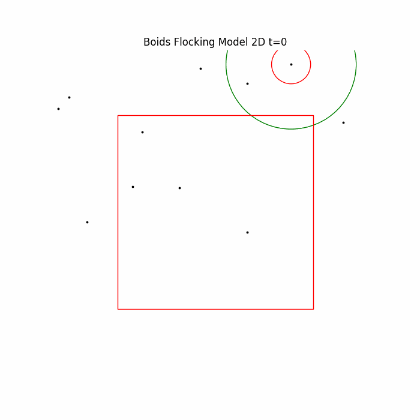

# Emergent Flocking with Reinforcement Learning

[](https://doi.org/10.5281/zenodo.19009222)

Teaching an agent to flock like a bird without ever being told the rules.

This project trains a **Deep Double DQN (DDQN)** agent to control a single boid (bird-like particle) inside a swarm of regular Reynolds boids. The agent learns, purely from reward signals, to exhibit the same emergent flocking behavior described by Craig Reynolds in 1987: cohesion, separation, alignment, and boundary avoidance.



---

## Abstract

Flocking behaviour, a widespread phenomenon in the natural world, represents coordination and collective motion observed among diverse species. Traditional approaches are mostly used to model this behaviour. However, these approaches rely on static flocking rules, limiting their adaptability to dynamic real-world scenarios. The challenge lies in effectively understanding and using this complex behaviour for practical applications. In this study, we present an approach using reinforcement learning to address this challenge. Our aim is to train autonomous agents to replicate flocking behaviour within a continuous 2D environment. The approach involves using a reward function to imitate flocking behaviour with an artificially generated flock. By overcoming these limitations, our study offers a deeper understanding of natural systems and broadens the scope for controlling swarming behaviours in various domains and environments.

---

## How it works

Craig Reynolds' classic boids model defines four simple local rules that, when followed by every agent in a swarm, produce complex flocking behavior:

| Rule                 | Description                                    |
| -------------------- | ---------------------------------------------- |
| **Cohesion**         | Move toward the center of nearby neighbors     |
| **Separation**       | Avoid crowding close neighbors                 |
| **Alignment**        | Match the average velocity of nearby neighbors |
| **Border avoidance** | Stay away from simulation boundaries           |

The RL agent does **not** have the rules hard-coded. Instead it receives an 11-dimensional observation describing its position, velocity, and the current flocking force vectors, then chooses one of 9 discrete velocity adjustments. It is rewarded for closely matching the ideal Reynolds trajectory and penalized for becoming isolated.

### Architecture

```text
config/default.yaml
        │
        ▼
   train.py
        │
        ├─► BoidEnv (gymnasium wrapper)
        │         │
        │         └─► BoidsModel (agentpy simulation)
        │                   ├── Boid × N  (Reynolds rules, no RL)
        │                   └── AgentBoid × 1  (RL-controlled)
        │
        └─► DoubleDQN (pfrl)
                  ├── QFunction  (4-layer MLP: 11 → 64 → 32 → 16 → 9)
                  ├── PrioritizedReplayBuffer
                  └── LinearDecayEpsilonGreedy
```

### State space (11D)

| Component         | Dims | Range            |
| ----------------- | ---- | ---------------- |
| Position          | 2    | [0, size]        |
| Velocity          | 2    | [-1, 1]          |
| Cohesion vector   | 2    | [-size, size]    |
| Separation vector | 2    | [-size, size]    |
| Alignment vector  | 2    | [-size, size]    |
| Neighbor count    | 1    | [0, population]  |

### Action space

9 discrete actions mapping to velocity adjustments on a 3×3 grid:
`(row, col) ∈ {0,1,2}² → delta = (row−1, col−1) ∈ {−1,0,+1}²`

### Reward

```text
reward = flocking_error × flocking_error_weight
       + grouping_error × grouping_error_weight

flocking_error = −MSE(ideal_Reynolds_vectors, actual_vectors)
grouping_error = −(base_penalty + dist_from_center)  if n_neighbors == 0
               = 0                                    otherwise
```

---

## Installation

```bash
git clone https://github.com/zakaria-narjis/Emergent-flocking-with-reinforcement-learning.git
cd Emergent-flocking-with-reinforcement-learning

pip install -r requirements.txt
pip install -e .
```

> **Python ≥ 3.10** is required.

---

## Quickstart

### Train with default settings (~25 min on CPU)

```bash
python train.py
```

Results are saved to `experiments/runs/<timestamp>/`.

### Quick smoke test (~2 min)

```bash
python train.py --override-config config/experiments/fast_debug.yaml --run-name debug
```

### Evaluate a trained agent

```bash
python evaluate.py --checkpoint experiments/runs/debug/checkpoints
```

### Evaluate with animation

```bash
python evaluate.py --checkpoint experiments/runs/debug/checkpoints --animate --episodes 5
```

This renders and saves `eval_animation.gif` to the run directory.

---

## Configuration

All hyperparameters live in `config/default.yaml`. To run a variant, create a new YAML that overrides only the values you want to change, then pass it via `--override-config`.

```text
config/
├── default.yaml                   # Base configuration (all parameters)
└── experiments/
    ├── fast_debug.yaml            # Smoke test (5k steps, 3 boids)
    └── large_population.yaml     # Larger swarm (20 boids, 80×80 space)
```

**Key config sections:**

| Section       | What it controls                                              |
| ------------- | ------------------------------------------------------------- |
| `simulation`  | Space size, boid count, episode length, flocking radii        |
| `reward`      | Flocking error weight, grouping penalty weight                |
| `agent`       | DDQN gamma, replay buffer capacity, update intervals          |
| `exploration` | Epsilon-greedy schedule (start, end, decay steps)             |
| `training`    | Total steps, evaluation frequency, device (cpu/cuda)          |
| `output`      | Experiments directory, optional run name                      |

---

## Project structure

```text
Emergent-flocking-with-reinforcement-learning/
├── train.py                      # Training entry point
├── evaluate.py                   # Evaluation + animation entry point
├── setup.py                      # Package install (pip install -e .)
├── requirements.txt
├── README.md
│
├── config/
│   ├── default.yaml              # All hyperparameters
│   └── experiments/
│       ├── fast_debug.yaml
│       └── large_population.yaml
│
├── src/
│   └── flocking/
│       ├── __init__.py
│       ├── boids.py              # Boid, AgentBoid (Reynolds + RL logic)
│       ├── simulation.py         # BoidsModel (agentpy simulation)
│       ├── environment.py        # BoidEnv (gymnasium wrapper)
│       ├── models.py             # QFunction, QFunction_LSTM (PyTorch)
│       ├── agent.py              # build_agent(), load_agent() factories
│       ├── utils.py              # normalize(), flatten_state()
│       └── visualization.py     # animate(), plot_training_curves()
│
├── notebooks/
│   └── Boids_updated.ipynb      # Original exploratory notebook
│
└── experiments/
    └── runs/
        └── <run_name>/
            ├── config_used.yaml  # Exact config snapshot (reproducibility)
            ├── checkpoints/      # PFRL model checkpoints
            └── training_curves.svg
```

---

## Results

Training the agent for 500k steps with default settings yields a DDQN that learns to stay within the swarm, match neighbor velocities, and avoid borders. Training converges in approximately **25 minutes on CPU**.

Evaluation scores range from −8090 to −1267 depending on initialization; the agent consistently avoids the worst-case isolation penalty (no neighbors).

---

## Future work

- **DDPG**: Replace the discrete action space with a continuous one for smoother velocity adjustments.
- **DRQN / HCAM**: Add recurrent memory (LSTM-based DRQN) so the agent can reason about temporal patterns rather than reacting only to the current observation.
- **Multi-agent**: Train multiple RL-controlled boids simultaneously with shared or independent policies.
- **3D flocking**: Extend `ndim=3` for volumetric swarm simulations.

---

## Citation

If you use this project, please cite it as:

```bibtex
@software{narjis_2026_19009222,
  author       = {Narjis, Zakaria},
  title        = {Emergent Flocking Behaviour using Reinforcement Learning},
  month        = mar,
  year         = 2026,
  publisher    = {Zenodo},
  version      = {v1.0.0},
  doi          = {10.5281/zenodo.19009222},
  url          = {https://doi.org/10.5281/zenodo.19009222}
}
```

This work builds on the boids model originally described in:

```text
Reynolds, C. W. (1987). Flocks, herds and schools: A distributed behavioral model.
ACM SIGGRAPH Computer Graphics, 21(4), 25–34.
```

---

## License

MIT
